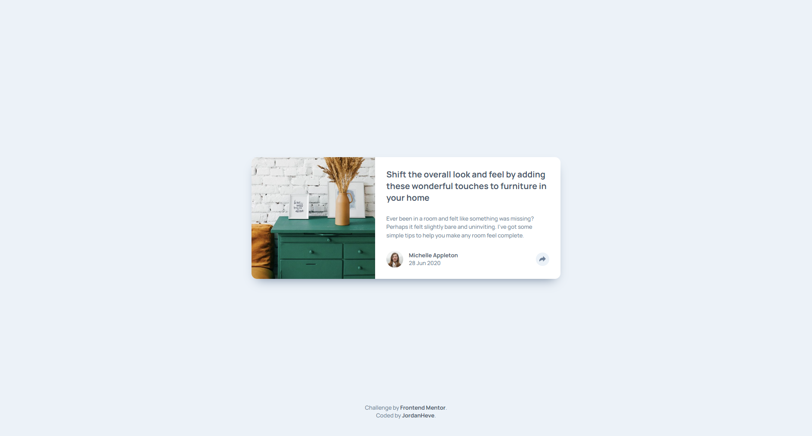

# Frontend Mentor - Article preview component solution

This is a solution to the [Article preview component challenge on Frontend Mentor](https://www.frontendmentor.io/challenges/article-preview-component-dYBN_pYFT). Frontend Mentor challenges help you improve your coding skills by building realistic projects. 

### Screenshot

### Links

- Solution URL: [Solution URL here](https://github.com/jordanheve/Article-preview-component)
- Live Site URL: [Live site URL here](https://jordanheve.github.io/Article-preview-component/)

### Built with

- Semantic HTML5 markup
- CSS custom properties
- Flexbox
- JS

